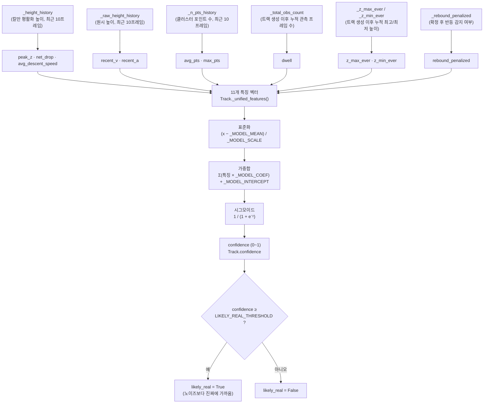

# ARDA — Automated Radar-based Detection & Alert

TI IWR6843AOPEVM 레이더를 이용한 실시간 물체 낙하 감지 시스템.

## 디렉토리 구조

```
ARDA/
├── config/
│   └── profiles/          # 레이더 .cfg 설정 파일
├── arda/
│   ├── radar/             # 시리얼 통신 & 프레임 파서
│   ├── processing/        # 포인트 클라우드 전처리 & 클러스터링
│   ├── detection/         # 낙하 감지 알고리즘 + 신뢰도 모델
│   ├── visualization/     # 실시간 3D 플롯
│   └── utils/             # 로거·설정 로더·좌표 변환·서보/열화상 연동 등 공통 유틸
├── data/
│   ├── raw/                    # record_and_view.py --label로 녹화한 세션 (배치별 폴더, data/raw/README.md 참고)
│   ├── labeling_worksheet.csv  # 낙하 신뢰도 모델 학습용 라벨링 데이터 ("낙하 신뢰도 모델" 절 참고)
│   ├── reference/               # 특정 실패 사례를 보여주기 위해 남겨둔 참고용 캡처 이미지
│   └── logs/                   # 실행 중 쌓이는 이벤트 로그
├── models/                # (현재 미사용) 신뢰도 모델은 파일로 저장하지 않고 fall_detector.py에 계수를 직접 하드코딩
├── scripts/               # 각 스크립트 역할은 "스크립트 설명" 절 참고
├── tests/                 # pytest 단위 테스트
└── main.py                # 실시간 감지 실행
```

## 사전 준비

- Python >= 3.12
- [uv](https://docs.astral.sh/uv/) (권장) 또는 pip
- IWR6843AOPEVM 레이더 보드 (실시간 감지 시 필요, 녹화 재생/테스트만 할 경우 불필요)

## 빠른 시작

```bash
# 저장소 클론
git clone https://github.com/ARDA-2026/arda-radar.git
cd arda-radar

# 의존성 설치
uv sync   # 또는 pip install -e .

# 테스트 (하드웨어 없이 실행 가능)
pytest

# 센서 설정 & 실시간 감지 실행 (하드웨어 연결 필요)
python main.py --cli-port /dev/ttyUSB0 --data-port /dev/ttyUSB1

# 낙하가 확정되는 순간의 좌표와 신뢰도가 UDP(127.0.0.1:9999)로 전송되어 sibling
# 프로젝트인 arda-servo(서보 모터 제어기)가 소비한다. 비활성화하려면 --no-servo-out.
# --thermal-gate를 주면 서보 전송과 별개로 열화상(arda-thermal-test) 판정을
# 먼저 기다렸다가 사람으로 확인된 경우에만 위치를 최종 로그로 남긴다.

# 데이터 녹화 + 시각화 (60초, 하드웨어 연결 필요). --label을 주면
# data/raw/<라벨>/ 아래 원시 데이터(.json)와 시각화 이미지(.png)도 저장
python scripts/record_and_view.py --duration 60 --label session1

# 녹화 재생·분석 (하드웨어 없이 검증 가능) — --label로 저장한 폴더 전체를
# 현재 config/모델로 다시 돌려 시행별 궤적과 판정 결과를 비교한다
python scripts/analyze_drops.py data/raw/session1
```

레이더 하드웨어가 없는 팀원은 `pytest`와 `scripts/analyze_drops.py`로 파이프라인 동작을 확인할 수 있습니다. (샘플 녹화가 `data/raw/`에 없으므로, 녹화가 있는 팀원에게 공유받아 넣어주세요 — `data/raw/`는 `.gitignore`로 저장소에서 제외돼 있습니다.)

## 하드웨어 연결

| 포트 | 역할 | 기본값 |
|------|------|--------|
| CLI port | 설정 명령 전송 | `/dev/ttyUSB0` |
| Data port | 포인트 클라우드 수신 | `/dev/ttyUSB1` |

Windows에서는 `COM3` / `COM4` 형식으로 지정.

## 좌표 기준(원점) 및 유효 범위 수정

레이더가 출력하는 `(x, y, z)`는 **센서 자체를 원점(0,0,0)으로 하는 좌표**입니다.

| 축 | 의미 | 단위 |
|----|------|------|
| `x` | 센서 정면 기준 좌우 (우측이 +) | m |
| `y` | 센서 정면 거리 (센서 바로 앞이 0, 항상 양수) | m |
| `z` | 센서 기준 높이 (센서와 같은 높이가 0) | m |

**원점 자체(0,0,0)는 소프트웨어에서 옮길 수 없습니다** — TI mmWave 하드웨어의
안테나 기준점으로 고정되어 있어, 원점을 바꾸려면 센서를 물리적으로
재장착/재조준해야 합니다. 소프트웨어에서 조정 가능한 건 "이 원점을 기준으로
어느 범위까지를 유효한 타겟으로 볼지"(ROI)입니다.

**ROI를 바꾸려면 여기를 고치세요**: `config/settings.yaml`의
`processing.roi.x` / `.y` / `.z`(단위 m). `arda.utils.load_processing_config()`를
통해 `main.py`를 비롯한 실시간·분석 스크립트 대부분이 이 값을 읽어 씁니다
(아래 "낙하 감지 설정값" 섹션 참고). [`arda/processing/pointcloud.py`](arda/processing/pointcloud.py)의
`PointCloud.filter_roi()` 기본 인자는, 이 설정을 읽지 않는 레거시 스크립트
(`scripts/replay.py`)에서만 실제로 쓰이는 폴백값입니다.

> arda-servo와 연계할 때는 이 원점·좌표축이 곧 서보 각도 계산의 기준이
> 됩니다 — 레이더와 서보가 물리적으로 같은 위치·같은 정면 방향에 있다고
> 가정하므로, 실제로 떨어져 있거나 방향이 어긋나 있다면 arda-servo 쪽
> README의 "좌표 기준(원점) 보정" 섹션을 참고하세요.

### 설치 위치 기준 실좌표 변환 (`site`)

낙하가 확정되면, 센서 기준 로컬 좌표(X: 좌우, Y: 정면 거리, m)를 **이
레이더가 실제로 설치된 지점의 GPS 위도/경도**로 변환해 로그에 남깁니다.
위 ROI와 달리 이 값은 **실제로 코드에서 읽어서 사용**합니다.

**설정 위치**: `config/settings.yaml`의 `site.lat` / `site.lon` /
`site.heading_deg`. 설정 파일 경로는 `--settings`로 바꿀 수 있습니다
(`--config`는 레이더 칩 자체의 `.cfg` 프로파일 경로라 서로 다른
옵션입니다).

```yaml
site:
  lat: 37.5336       # 설치 지점 위도 (도)
  lon: 126.9364       # 설치 지점 경도 (도)
  heading_deg: 140.0    # 센서 정면(Y축)이 향하는 나침반 방위각 (정북 0°, 시계방향 동 90°)
```

**변환은 `heading_deg`만큼 로컬 좌표를 회전시켜 동/북 변위로 바꾼 뒤
위도/경도에 더하는 방식입니다** ([`arda/utils/site.py`](arda/utils/site.py)의
`local_to_latlon()`). 방위각 θ 방향의 단위벡터는 `(East=sin θ, North=cos θ)`이고,
센서 정면(Y)의 방위각은 `heading_deg`, 우측(X)은 그보다 시계방향으로 90도
회전한 방위각이므로:

```
East  = x·cos(heading) + y·sin(heading)
North = -x·sin(heading) + y·cos(heading)
```

이 회전 덕분에 **기기가 어느 방향을 보고 설치되든(반드시 정북일 필요
없음) 좌표 계산에 쓰이는 부호가 자동으로 맞습니다** — 예를 들어
`heading_deg=90`(정동)이면 센서의 "정면(Y)"이 실제로는 동쪽 이동으로,
`heading_deg=180`(정남)이면 정면(Y)·우측(X) 둘 다 부호가 반대로
계산됩니다. 경도는 위도에 따라 실제 거리가 압축되므로
(`east_m / (111_320 × cos(lat))`) 위도값에 맞춰 보정합니다.

**Z(고도)는 다루지 않습니다.** 낙하 확정 시점의 실측 로컬 Z는 "바닥에
닿은 높이"가 아니라 피크보다 일정량 이상 떨어진 순간의 높이라 아직
완전히 착지하기 전일 수 있어 신뢰할 수 없습니다 — 낙하는 바닥에서
일어난다고 간주하고 수평 위치(위도/경도)만 보고합니다.

## 알고리즘 흐름

```
레이더 프레임 → SNR/ROI 필터 → DBSCAN 클러스터링 → 클러스터마다 독립 Track 추적
              → FallDetector.update() → 트랙 중 하나라도 낙하 확정되면 보고 (+ 신뢰도 부여)
```

1. **필터링**: 노이즈(낮은 SNR) 및 관심 영역(ROI) 밖 포인트 제거
2. **클러스터링 & 다중 추적**: DBSCAN으로 포인트를 묶은 뒤, 클러스터마다 독립된 `Track`을
   만들어 계속 추적합니다. (이전엔 매 프레임 클러스터 하나를 미리 "그 물체"로 확정해 그
   하나의 이력만으로 판정했는데, 씬에 클러스터가 여러 개 있을 때 잘못 하나를 고르면 전체
   판정이 그 오답을 따라가는 문제가 있었습니다. 그래서 지금은 반대로, 사람이든 노이즈든
   자기 트랙 안에서 조용히 추적만 되고 실제로 낙하 패턴을 보이는 트랙만 확정되는 방식으로
   바꿨습니다.)
3. **낙하 판정** (`FallDetector`, 트랙마다 독립적으로 매 프레임 높이(Z)를 이력에 누적):
   아래 세 경로 중 하나라도 만족하면 낙하로 판정
   - **경로 1 (착지 후 소실, 주 경로)**: 피크(공중) 이후 일정 프레임 이상 연속 하강하다 클러스터가 레이더에서 사라지면(바닥 근처 소실) 착지로 판단
   - **경로 2 (저 Z 직접 감지, 보조 경로)**: 물체가 레이더에 계속 보이는 상태로, 피크 대비 충분히 하강한 경우 직접 감지
   - **경로 3 (자유낙하 궤적, 시작 위치 무관)**: 절대 높이 기준 없이, 최근 프레임들의 속도가 중력 근방으로 계속 가속하며 떨어지는 패턴이면 어디서 처음 포착됐든 낙하로 판정
4. **신뢰도 부여**: 낙하로 확정된 트랙에 한해, 학습된 로지스틱 회귀로 "노이즈보다 진짜에
   가까운 특징을 얼마나 갖췄는지" 신뢰도(0~1)를 매깁니다 — 이진 판정 자체는 바꾸지 않는
   보조 지표입니다 (아래 "낙하 신뢰도 모델" 절 참고).

## 낙하 감지 설정값

값 자체가 튜닝 중 자주 바뀌어서 여기엔 각 값이 "무엇"인지만 적고 "지금 얼마인지"는
적지 않습니다 — 정확한 현재값은 항상 원본 파일을 확인하세요.

### `config/settings.yaml`의 `processing:` 섹션

`arda.utils.load_processing_config()`를 통해 `main.py`와 `scripts/detect.py`·
`trajectory.py`·`record_and_view.py`·`analyze_drops.py`·`retrace_track.py`가
공통으로 읽습니다 — 이 파일 한 곳만 고치면 전부에 반영됩니다.

| 항목 | 의미 |
|------|------|
| `min_snr` | 노이즈 포인트 제거용 최소 SNR — 근거리·작은 물체일수록 낮게 잡아야 약한 반사도 포착 |
| `roi.x` / `.y` / `.z` | 감지 대상으로 볼 관심 영역 범위 (m) |
| `min_abs_doppler` | 정적(비이동) 포인트 제거 임계값 (`main.py`의 `filter_stationary` 전용) |
| `cluster_eps` | DBSCAN 클러스터링 반경 (m) — 물체가 작을수록/근거리일수록 줄임 |
| `cluster_min_samples` | 클러스터로 인정할 최소 포인트 수 |
| `max_jump` | 트랙 예측 위치 기준, 클러스터를 그 트랙으로 매칭할 최대 거리 (m) — 다중 추적용 |

> `detection:` 섹션(`history_window`, `height_drop_threshold`, `fall_doppler_threshold`,
> `z_velocity_threshold`)은 여전히 이전 버전 알고리즘 기준으로 남아있는 문서용 값이며,
> `history_window`를 제외하면 코드에서 읽어오지 않고 현재 로직과도 맞지 않습니다.
> `history_window`는 `FallDetector` 생성 시 인자로 넘길 수 있으나 현재 어떤 진입점도
> 그렇게 연결해두진 않았습니다(전부 `fall_detector.py`의 `HISTORY_WINDOW` 상수를 씁니다).
> 판정 임계값을 튜닝할 때는 아래처럼 `fall_detector.py` 상단 상수를 직접 수정하세요.

### `arda/detection/fall_detector.py` 상단 상수

실제 판정 임계값은 전부 여기서 관리됩니다. 왜 그 값으로 정했는지(실측 데이터, 시도했다가
버린 접근들)는 각 상수 바로 위 주석에 자세히 남겨뒀습니다 — 코드를 직접 열어서 확인하세요.

| 그룹 | 상수 |
|------|------|
| 경로 1/2 (피크-하강) | `PEAK_DROP_THRESHOLD`, `MIN_DESCENT_FRAMES`, `MIN_AVG_DESCENT_SPEED`, `RISING_TOLERANCE` |
| 경로 3 (자유낙하) | `FREEFALL_MIN_FRAMES`, `FREEFALL_ACCEL_MIN` / `_MAX`, `FREEFALL_MIN_TRIGGER_SPEED`, `FREEFALL_WINDOW_MAX` |
| 다중 추적 (트랙 매칭/생명주기) | `MAX_JUMP`, `TRACK_MAX_MISSES` |
| 트랙 분류 (사람 vs 낙하 물체) | `PERSON_Z_RANGE_MIN`, `PERSON_MIN_DURATION`, `FALL_Z_DROP_MIN` |
| 신뢰도 모델 | `LIKELY_REAL_THRESHOLD` — 아래 "낙하 신뢰도 모델" 절 참고 |

## 낙하 신뢰도 모델

이진 낙하 판정(위 "낙하 판정" 단계)은 위 상수들만으로 결정되는 규칙 기반이라, 노이즈로
인한 오판정을 하드 게이트로 더 걸러보려는 시도들을 실측 데이터로 여러 번 검증했지만
번번이 진짜 낙하까지 같이 잃었습니다. 그래서 판정 자체를 더 엄격하게 만드는 대신, **이미
확정된 낙하에 한해** "이게 노이즈보다 진짜에 가까운 특징을 얼마나 갖췄는지" 보조 신뢰도
점수(`Track.confidence`, 0~1)를 매기는 방식을 택했습니다.

이 점수는:
- `main.py`에서 서보 좌표 전송(`CoordSender.send(..., confidence=...)`)과 열화상 게이트
  (`--thermal-gate`) 양쪽 모두, 이미 대기 중인 후보보다 더 확률 높은 낙하가 새로 확정되면
  즉시 그쪽으로 전환(선점)하는 데 쓰입니다.
- `Track.likely_real`(`confidence >= LIKELY_REAL_THRESHOLD`)로 "노이즈보다 진짜에
  가깝다"는 이진 판단도 제공합니다. 낙하 감지는 놓치는 게 오탐보다 훨씬 치명적이라,
  이 임계값은 기본 0.5보다 낮게 잡은 재현율 우선 값입니다.

### 특징(feature)과 모델 구조

로지스틱 회귀 하나(은닉층 없음)라 "계층"이라 부를 만한 게 크진 않지만, 원시 관측치가
최종 confidence까지 가는 과정을 단계별로 그리면 다음과 같습니다 — `Track._unified_features()`
→ `Track._model_confidence()`를 그대로 도식화한 것입니다.



왼쪽 6개 박스는 `Track`이 매 프레임 갱신하는 원시 상태인데, 성격이 셋으로 나뉩니다 —
`_height_history`/`_raw_height_history`/`_n_pts_history`는 최근 프레임만 담는 rolling
window(최대 10개), `_total_obs_count`/`_z_max_ever`/`_z_min_ever`는 window 크기와
무관하게 트랙이 살아있는 동안 계속 누적되는 값, `_rebound_penalized`는 확정 후 반등이
확인되는 순간 한 번 True로 바뀌는 단순 플래그입니다. 표준화(`_MODEL_MEAN`/`_MODEL_SCALE`)와
가중합(`_MODEL_COEF`/`_MODEL_INTERCEPT`)은 학습 시점에 고정된 상수이고, 실제 배포
코드에서는 이 전체 계산이 트랙이 낙하로 확정되는 그 순간 딱 한 번 실행됩니다.

| 특징 | 의미 |
|------|------|
| `dwell` (`total_obs_count`) | 이 트랙이 생성된 이후 실제로 클러스터에 매칭된 총 프레임 수 (누적, rolling window 아님). 노이즈는 짧게 반짝하다 사라지는 경향이 있어 "얼마나 오래 잡혔는가"를 반영 |
| `peak_z` (`peak_z_smoothed`) | 칼만 평활화된 높이 이력 중 최고 높이 — "공중에 얼마나 높이 있었는가", 경로 1/2(피크-하강) 판정의 피크값과 같은 개념 |
| `net_drop` (`net_drop_from_peak`) | peak_z에서 이력상 마지막 높이를 뺀 순 하락폭 — 클수록 확실히 떨어진 것 |
| `avg_descent_speed` | net_drop ÷ (피크~마지막 프레임 경과시간) — 느리게 살살 내려온 물체와 빠르게 떨어진 물체를 구분 |
| `recent_v` (`recent_velocity`) | 원시 높이 이력의 최근 최대 3프레임 구간에서 계산한 마지막 순간속도(m/s) — 경로 3(자유낙하) 판정과 같은 기준. 음수일수록 빠르게 하강 중 |
| `recent_a` (`recent_accel`) | 위 최근 속도들의 변화율(m/s²) — 진짜 자유낙하라면 중력(-9.8) 근방, 노이즈는 훨씬 크거나 작은 값이 나오는 경향 |
| `z_max_ever` | 트랙 생성 이후 지금까지 관측된 원시 높이의 최댓값 (누적, rolling window와 무관) |
| `z_min_ever` | 위와 대칭, 지금까지 관측된 원시 높이의 최솟값 |
| `avg_pts` | 최근 이력 구간 클러스터 포인트 수의 평균 — 작은 물체는 포인트가 적고, 사람/큰 노이즈 뭉치는 포인트가 많은 경향 |
| `max_pts` | 같은 구간 클러스터 포인트 수의 최댓값 |
| `rebound_penalized` | 확정 직후(최대 3프레임) 반등이 감지됐는지(0/1). 학습 데이터는 "확정되는 바로 그 순간" 값이라 전부 0이라 이 계수는 사실상 0으로 학습됐지만(_MODEL_COEF 참고), 배포 코드에서 이후 실제로 반등이 확인되면 confidence가 이 값을 반영해 한 번 더 재계산됨 |

### 데이터: `data/labeling_worksheet.csv`

낙하로 확정(`fell=True`)된 트랙들의 **확정 순간** 특징값(`Track._unified_features()`
참고 — 관측 프레임 수, 피크 높이·하락폭·평균 하강 속도, 최근 속도·가속도, 관측된
최대/최소 높이, 평균/최대 클러스터 포인트 수, 반등 여부)과 사람이 매긴 정답 라벨
(`label`: 1=진짜 낙하, 0=노이즈)을 한 행씩 담습니다. `suggested_label`/`suggested_note`는
참고용 힌트일 뿐이고, 최종 판단(`label`/`label_note`)은 항상 사람이 직접 채웁니다.

**라벨링 규칙 — `fell=True`로 확정된 트랙만 라벨링합니다.** 신뢰도는 실제 배포 코드에서
확정되는 그 순간에만 계산되므로(`Track.update()` 참고), 한 번도 확정되지 않은 트랙을
억지로 라벨링하면 라이브에서 절대 나오지 않는 특징 분포를 학습시키는 셈이 됩니다.

### `scripts/retrace_track.py` — 라벨링 보정 도구

자동 다중 추적이 낙하 물체를 여러 트랙으로 쪼개거나 도중에 다른 클러스터로 갈아타는
(하이재킹) 경우, 자동 트랙 경계만으로는 그 사건의 올바른 궤적을 하나로 얻을 수 없습니다.
이 도구는 저장된 녹화를 다시 불러와 Z(t) 그래프 위에 (그 순간의 자동 추적 트랙 ID로
색칠된) 배경을 띄우고, 사용자가 마우스로 낙하 물체라고 생각되는 궤적을 그리면 프레임마다
가장 가까운 DBSCAN 클러스터 중심에 매칭합니다(`--max-z-gap`으로 매칭 거리 상한 조절 —
너무 멀면 매칭하지 않고 건너뜁니다). 매칭된 클러스터 시퀀스는 실제 `Track` 클래스에
그대로 흘려보내 특징을 계산합니다 — 별도 코드로 재구현하지 않고 배포 코드를 그대로
재사용해, 학습·서빙 시점이 어긋나는 문제를 원천적으로 피합니다.

```bash
uv run scripts/retrace_track.py data/raw/<배치>/record_raw_*.json --batch <배치명>
```

### 재학습

```bash
uv run scripts/train_confidence_model.py --threshold 0.24   # 0.24는 예시 — 아래 참고
```

`data/labeling_worksheet.csv`의 라벨(0/1)로 로지스틱 회귀(`StandardScaler` +
`LogisticRegression`)를 **배치 단위 leave-one-out**으로 검증합니다 — 무작위 분할을
쓰면 같은 낙하 사건에서 조각난 여러 트랙이 train/test 양쪽에 걸쳐 사실상 같은 정보를
중복 제공해 성능이 부풀려질 수 있어, 배치(녹화 세션) 전체를 통째로 남겨서 검증합니다.
출력에는 threshold sweep 표, 재현율 우선 정책에 맞는 임계값 후보(FN 0~1건 지점), 전체
데이터로 재학습한 최종 배포용 계수, 그리고(`--threshold` 지정 시) 그 계수를 실제
`Track._model_confidence()`와 똑같은 시그모이드 공식으로 재현해 라벨과 비교하는
in-sample 검증까지 포함됩니다 — 계수를 코드에 옮겨적는 과정에서 생기는 오타를 여기서
미리 잡을 수 있습니다.

이 스크립트는 **`fall_detector.py`를 직접 고치지 않습니다.** 어떤 계수를 배포할지,
`LIKELY_REAL_THRESHOLD`를 얼마로 둘지는 재현율/정밀도 트레이드오프를 보고 사람이
판단해야 하는 결정이라, 출력된 계수를 검토한 뒤 `arda/detection/fall_detector.py`의
`_MODEL_MEAN`/`_MODEL_SCALE`/`_MODEL_COEF`/`_MODEL_INTERCEPT`/`LIKELY_REAL_THRESHOLD`에
직접 반영하고, 왜 바꿨는지(배치 구성, 검증 지표, 임계값을 그렇게 정한 이유)를 그 위
주석에 남기길 권합니다 — 기존 `_MODEL_*` 주석들이 그 형식을 따르고 있습니다. 계수
11개짜리 로지스틱 회귀라 `models/`에 파일로 저장하고 실행 시 로딩하는 것보다 상수로
두는 편이 더 단순하다고 판단해 하드코딩 방식을 유지합니다.

## 스크립트 설명 (`scripts/`)

| 스크립트 | 역할 |
|----------|------|
| `check_ports.py` | 센서 연결 전 포트 진단 — CLI/Data 포트에서 raw 바이트가 들어오는지만 확인 |
| `record_and_view.py` | 녹화 후 포인트·클러스터·타겟 무게중심의 Z(t)/X(t)/Y(t) 궤적을 그래프로 시각화 (기본: 화면 표시만). `--label`을 주면 원시 데이터(JSON)와 시각화 이미지(PNG)를 `data/raw/<라벨>/`에 저장, `--duration`으로 녹화 시간 조절 |
| `analyze_drops.py` | `record_and_view.py --label`로 녹화한 폴더 하나를 현재 config/모델로 일괄 재생해, 시행별 궤적·판정 결과를 비교 그래프와 요약 통계로 출력 (하드웨어 불필요) |
| `retrace_track.py` | 저장된 녹화 하나를 불러와 마우스로 궤적을 그려 라벨링용 트랙을 보정 — 위 "낙하 신뢰도 모델" 절 참고 |
| `train_confidence_model.py` | `data/labeling_worksheet.csv`로 낙하 신뢰도 모델을 재학습하고 배포용 계수를 출력 (`fall_detector.py`는 직접 고치지 않음) — 위 "재학습" 절 참고 |
| `replay.py` | (레거시) JSONL 형식 녹화를 재생하며 낙하 감지 로직을 검증 — config를 읽지 않고 `pointcloud.py`/`clustering.py`의 기본값을 그대로 씀. 현재 녹화 도구(`record_and_view.py`)는 이 형식을 만들지 않으므로 실질적으로 쓰이지 않음 |
| `detect.py` | 실시간 낙하 감지 실행 — SNR/ROI 필터 → DBSCAN → `FallDetector` 다중 추적 |
| `trajectory.py` | 실시간으로 Z축 하강 궤적과 감지 상태를 시각화 (`detect.py`와 동일 파이프라인) |
| `monitor.py` | 낙하 감지 없이 원시 포인트 클라우드만 실시간 모니터링 |
| `rdmap.py` | Range-Doppler Map(거리·속도별 신호 세기) 실시간 시각화 |

## 커밋 규칙

- 작업 진행 중인 커밋은 커밋 메시지 맨 앞에 `[WIP]` 태그를 붙입니다. 예: `[WIP] 클러스터링 파라미터 튜닝`
- 회의/발표용으로 확정된 최종 코드는 `[Done]` 태그를 붙입니다. 예: `[Done] 낙하 감지 임계값 확정`
- 그 외 세부 파트별 작업은 각자 별도 저장소(ARDA-2026 조직 내)에서 자유롭게 진행합니다.
